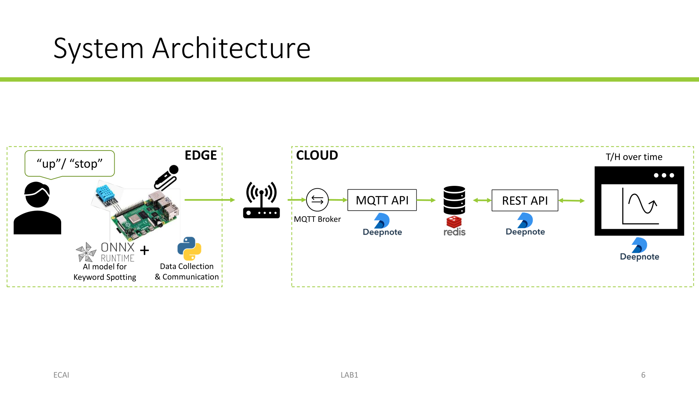

Across the labs, we will build a smart hygrometer: an IoT system that measures temperature and humidity, sends readings to the cloud, provides a voice user interface for configuration. A web application displays the measurements over time.

## Edge device

A Raspberry Pi collects temperature and humidity from a DHT-11 sensor and audio from a USB microphone. It runs an AI model locally with ONNX Runtime for user intent understanding, alongside Python code for data collection and communication.

## Cloud services

The Raspberry Pi sends sensor readings through an MQTT broker to a cloud MQTT API. The cloud stores the readings in a Redis Database. A REST API provides access to the data for a web application, which visualizes temperature and humidity over time.
