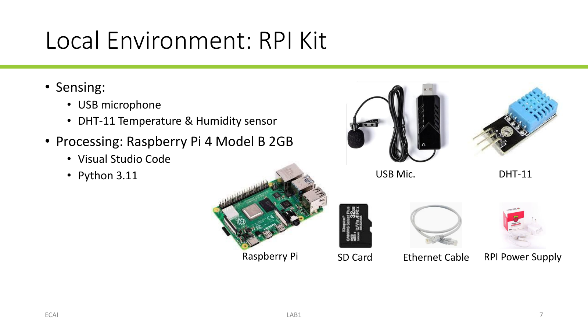
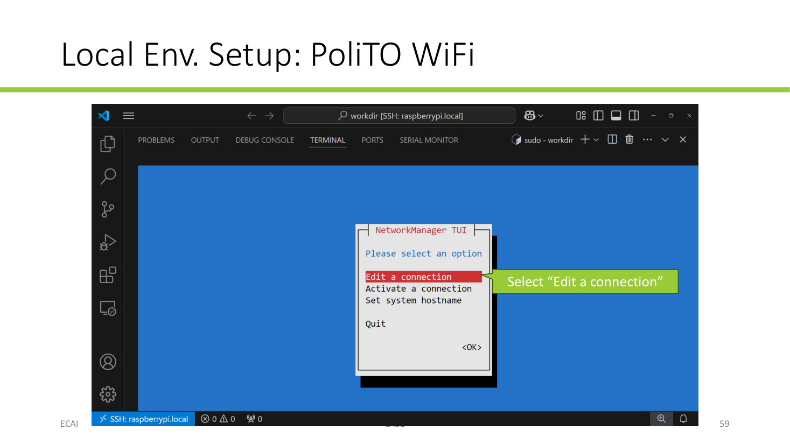
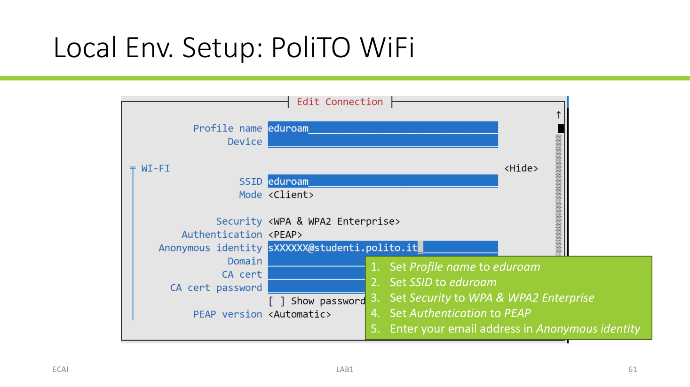
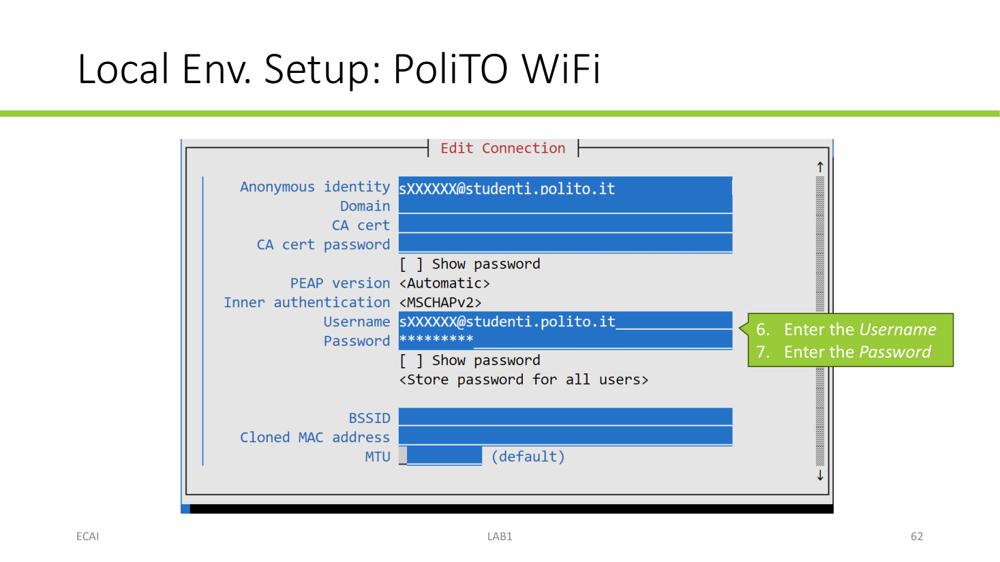
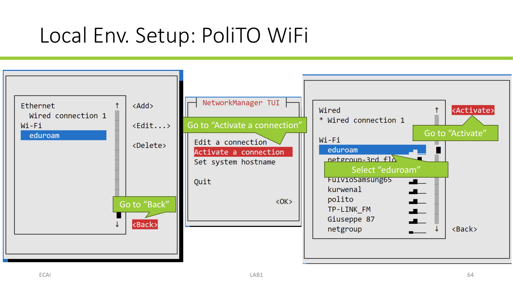
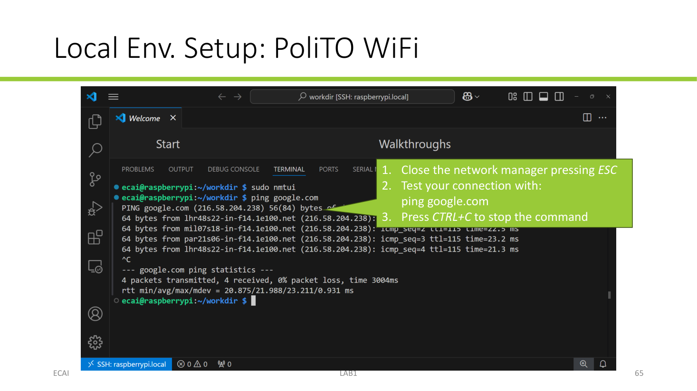

Use this guide to prepare the Raspberry Pi for the local lab exercises. The supplied SD card contains a Raspbian development environment with the Python packages needed for the labs.

## Kit contents and requirements

The kit is based on a Raspberry Pi 4 Model B (2 GB) and includes:

- a Raspberry Pi and its SD card;
- a power supply;
- an Ethernet cable;
- a USB microphone;
- a DHT-11 temperature and humidity sensor.

You will also need a laptop with **Visual Studio Code** (VS Code) installed. The setup below uses the VS Code **Remote - SSH** extension to work on the Pi from your laptop.

For the first two lab sessions, we'll use only the RPI board; the sensors will be used later.



## Connect and start the Raspberry Pi

1. Connect the Pi to your laptop with the Ethernet cable.
2. Connect the DHT-11 sensor as described below. Check each wire before powering the Pi: incorrect wiring can damage the sensor.
3. Connect the Pi to its power supply and wait about two minutes for it to start.

::: {.callout-warning}

## Shut down before disconnecting power

Before unplugging the Pi, run this command in its terminal:

```bash
sudo shutdown -h now
```

Wait until the green LED stops blinking, then disconnect the power supply. Removing power without shutting down can damage the Raspberry Pi or its SD card.
:::

## Connect from VS Code over SSH

1. Open VS Code on your laptop.
2. Open **Extensions**, search for **Remote - SSH** (published by Microsoft), and install it.
3. Open the Command Palette from **View → Command Palette…** (or press `Ctrl+Shift+P` on Windows/Linux, `Cmd+Shift+P` on macOS).
4. Run **Remote-SSH: Connect to Host…**.
5. Enter `ecai@ecai` and press Enter.
6. If VS Code asks whether to continue connecting to the host, choose **Continue**.
7. When prompted, enter the provided Pi password `ecailab` and press Enter.

Once connected, VS Code opens a remote window for the Raspberry Pi. This password is for the provided lab kit; do not reuse it for personal accounts.

## Create a working directory and check Python

In the remote VS Code window, open **Terminal → New Terminal**. Create a directory for your lab files and open it in VS Code:

```bash
mkdir -p ~/workdir
cd ~/workdir
code .
```

Create a file named `myscript.py`, enter the following code, and save it:

```python
print("Hello RPi!")
```

Run it from the terminal:

```bash
python myscript.py
```

The expected output is:

```text
Hello RPi!
```

The Pi is ready for the lab when VS Code is connected over SSH and this script runs successfully.

## Configure Wi-Fi

Configure WiFi with NetworkManager's text interface:

```bash
sudo nmtui
```

Use the arrow keys and Enter to navigate.



### Connect to eduroam

1. Select **Edit a connection**, then **Add**, then **Wi-Fi**.
2. Set **Profile name** and **SSID** to `eduroam`.
3. Set **Security** to **WPA & WPA2 Enterprise** and **Authentication** to **PEAP**.
4. Enter your student email address as the **Anonymous identity**.
5. Enter your eduroam username and password in the corresponding fields.
6. Select **OK** to save the profile.

   

   

7. Return to the main menu, select **Activate a connection**, choose `eduroam`, and activate it.

   

8. Exit `nmtui` with `Esc` and test connectivity:

   ```bash
   ping google.com
   ```

   Stop the test with `Ctrl+C`.

   

### Connect to a personal Wi-Fi network or mobile hotspot

If eduroam is unavailable, a personal Wi-Fi network or mobile hotspot can be configured in `nmtui`. Some exercises may require a mobile hotspot while working in class.

1. Select **Edit a connection → Add → Wi-Fi**.
2. Set **Profile name** and **SSID** to the network name.
3. Set **Security** to **WPA & WPA2 Personal** and enter the network password.
4. Select **OK** to save the profile.
5. Select **Activate a connection**, choose the profile, and activate it.
6. Exit `nmtui` with `Esc`.

## Set up a persistent VS Code tunnel

A VS Code tunnel lets you connect to the Raspberry Pi remotely without connecting through the ethernet cable.

Install VS Code on the Pi:

```bash
sudo apt update
sudo apt install code
```

Then check that the `code` command is available:

```bash
code --version
```

Start a tunnel to authenticate the Pi with your GitHub or Microsoft account and give the tunnel a recognizable name:

```bash
code tunnel --name ecai-rpi-<N>
```

Replace <N> with your group ID. Follow the displayed sign-in steps. After the tunnel connects successfully, stop this foreground process with `Ctrl+C`, then install it as a service so it starts automatically and persists across logouts and reboots:

```bash
code tunnel service install
```

Check the terminal output for confirmation that the service was installed. Keep the Pi powered on and connected to Wi-Fi with internet access for the tunnel to be reachable.

### One tunnel per user

Multiple people can work remotely by using separate Linux accounts on the Pi and setting up a tunnel under each account. Each person should:

1. Use their own Pi account and home directory (an administrator can create accounts with `sudo adduser <username>`).
2. Run `code tunnel` to authenticate with their own GitHub or Microsoft account.
3. Give the tunnel a distinct name, for example `ecai-<username>`, and install its service from that account with `code tunnel service install`.

Each user's files and tunnel service remain associated with their Linux account. Do not share a Linux password between group members.

### Connect from your PC

On the computer you want to work from:

1. Install and open VS Code.
2. Open **Extensions**, search for **Remote - Tunnels** (published by Microsoft), and install it.
3. Sign in to VS Code with the same GitHub or Microsoft account used to authenticate that tunnel on the Raspberry Pi.
4. Open the Command Palette (**View → Command Palette…**, or `Ctrl+Shift+P` on Windows/Linux and `Cmd+Shift+P` on macOS).
5. Run **Remote Tunnels: Connect to Tunnel…**.
6. Select the Raspberry Pi tunnel by its name. If prompted, choose **Continue** to connect.
7. Once connected, open a folder on the Pi or open a terminal in the remote window to work with your files.

The tunnel connection works while the Raspberry Pi is powered on and connected to a Wi-Fi network with internet access. If the Pi is offline or has no Wi-Fi/internet connection, the PC cannot reach its tunnel.
