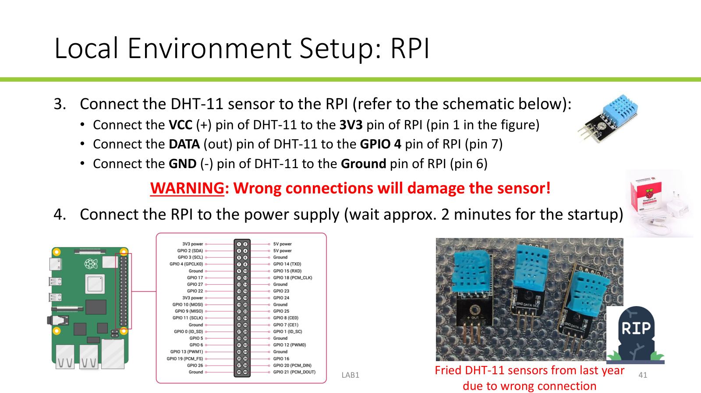

## DHT-11 wiring

Connect the sensor pins to the Raspberry Pi GPIO header as follows:

| DHT-11 pin | Raspberry Pi connection |
| --- | --- |
| VCC (+) | 3V3, physical pin 1 |
| DATA (out) | GPIO 4, physical pin 7 |
| GND (-) | Ground, physical pin 6 |

The slide below shows the header pin numbering and sensor wiring. Confirm the pin numbers before connecting the sensor.

## Microphone

The microphone can be simply connected to one of the available USB ports.
